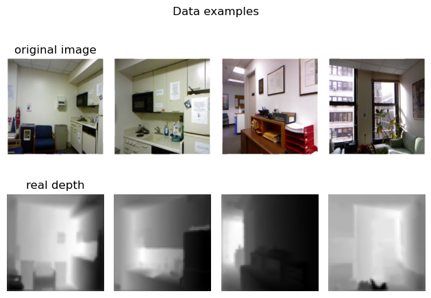
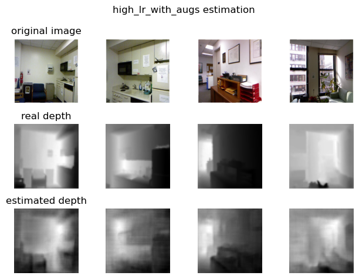

# ENNCA Project
Depth estimation report

## Introduction
The focus of this project is to build a model capable of estimating the depth of 3D scenes from monocular RGB image data. 

According to the [project requirements](../project_requirements.md) 5 models were trained, 3 of them with augmentations and different learning rates, and one of them without augmentations. The files in the `src` folder are taken from the [Kaggle notebook](depth_estimation.ipynb) used to train the model, although slightly modified (names, structure, etc.). 

## Data
The dataset used for this task is the [NYU Depth V2 dataset from Kaggle,](https://www.kaggle.com/datasets/soumikrakshit/nyu-depth-v2) which is comprised of RGB images of interiors and their ground truth depth maps.

The model will take in `224x224` RGB images and will produce `56x56` single channel images, where values closer to 0 indicate a shorter distance to the observer, and values closer to 1 indicate longer distances to the observer. 

When augmenting the data, both the input image and the expected result must receive the same augmentations. For example, when applying a random horizontal flip, both images must be flipped, not just one of them.

To achieve this we stack the input and the target tensors, apply the transform, and then split the resulting tensor.

> Data examples

## Architecture
The architecture consists on a [`EfficientNet` encoder](src/efficientnet_wrapper.py) and 3 [`BiFPN` decoder blocks](src/decoder_block.py). The features from the encoder are extracted and passed through 3 different decoder blocks. In each decoder block we take the features of size `14x14` and `28x28`, we upscale them to a common size, and concatenate.

Then the result of the 3 decoder blocks is concatenated and a residual is added, finally it is passed through an [inception module](src/inception_block.py), which is useful to detect features at different sizes, and finally through 2 [separable convolution blocks](src/sep_conv_block.py) to get the desired output with 1 channel.

All activations (except for the ones in the `EfficientNet` and the final, output one) have been replaced with [`GELU`](https://arxiv.org/abs/1606.08415), which has given better results than `ReLU` and is faster to compute than `SiLU`. The final activation used is `ReLU6` after experimenting with the `Sigmoid`, `ReLU` and identity functions.

## Training
The loss function used is MSE loss. An accuracy metric calculated using the **Structural Similarity Index Meassure** (`SSIM`) is used for evaluation purposes, but it doesnt take part in the actual backpropagation.

The chosen optimizer is [Adan](https://arxiv.org/abs/2208.06677) with a weight decay value of `1e-4`, which has proven to give excellent results.

The models were trained on Kaggle using GPU, 16 bit precision, weight decay to reduce the risk of overfitting, and [gradient clipping](https://neptune.ai/blog/understanding-gradient-clipping-and-how-it-can-fix-exploding-gradients-problem).

## Results

### Low learnign rate (`2e-4`) with augmentations

- **Test accuracy:** `0.7456409931182861`
- **Test loss:** `0.01476159505546093`

### Medium learning rate (`2e-3`) with augmentations

- **Test accuracy:** `0.7753664255142212`
- **Test loss:** `0.0142685072`

### High learning rate (`8e-3`) with augmentations
Higher values caused the weights to explode (even using gradient clipping).

- **Test accuracy:** `0.7525391578674316`
- **Test loss:** `0.016138572245836258`

### Medium learning rate (`2e-3`) without augmentations

- **Test accuracy:** `0.7676243185997009`
- **Test loss:** `0.015202163718640804`

|
> [Link to the image](outputs/mid_lr_without_augs.png), if it doesn't load

## Conclussions and further improvements
The learning rate of `2e-3` with augmentations gives the best result, and the same learning rate without augemntations gives the second better results.

Further improvements could consist on implementing [Stochastic Weight Averaging](https://arxiv.org/abs/1803.05407v3), training for longer periods of time and on an even larger dataset with the learning rate that gave the best results.

## Extras
Here are some 3D visualizations of the estimated depth of some samples using the best model. The visualizations were made using the [Rerun framework](https://www.rerun.io/) in the [visualizations script](visualizations.py).

### Bedroom scene

### Bathroom scene

### Living room scene

